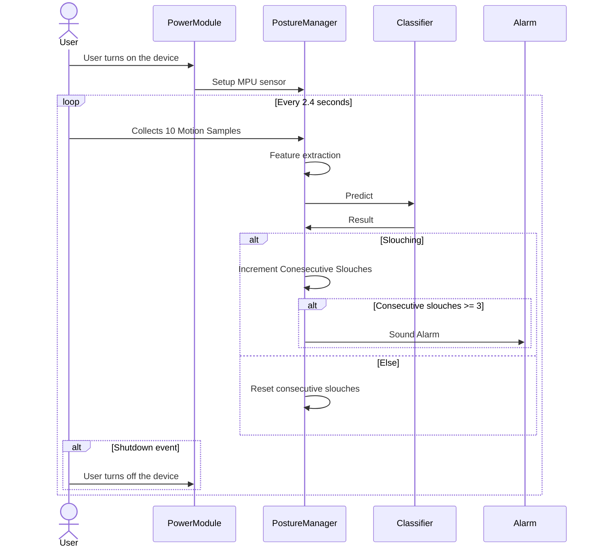

# Wearable Posture Corrector Device

## Summary
> A wearable device that alerts the user after prolonged slouching.

https://user-images.githubusercontent.com/84931559/156413828-600d1e9e-73e9-4acd-ada2-8e82b057e9b7.mp4
> Note: You may need to turn up volume to hear alarm in the video.

## Context
- This project utilizes a Scalable, Efficient, and Fast classifieR (SEFR) machine learning algorithm.
  - Fast in both training and prediction while maintaining resource efficiency.
  - Low-power consumption with minimal memory footprint, making it ideal for microcontroller applications.
  - This project uses the `micromlgen` library from this [post](https://eloquentarduino.github.io/2020/07/sefr-a-fast-linear-time-classifier-for-ultra-low-power-devices/).
- The classifier uses 600 training data samples (300 samples each for slouching and non-slouching)
- Input features to the SEFR classifier 
  - Mean acceleration along the X, Y, Z axes
  - Mean RMS acceleration along the X, Y, Z axes
- Device components
  - ATmega328 MCU
  - Lithium Battery Charging Board
  - Pushbutton Power Switch 
  - 3D printed case enclosure
  - Piezo used as an alarm

## Setup
1. Extract training data for both slouching and non-slouching.
2. Copy the training data to a .csv file and label the features as 1 for slouching and 0 for non-slouching.
3. Run the `sefr_ml.py` Python script in `/scripts` with the training data .csv file to generate the C code for the SEFR classifier using the `micromlgen` library.
4. Copy the output and save as a C header file to be included in the project.
5. Use the header file and call the `predict()` function to make predictions using the trained classifier.

## Schematic

## Sequence Diagram
> The device is set to alert the user after approximately 7 seconds of continuous slouching. This setting can be adjusted in the code according to the user's preferences.
