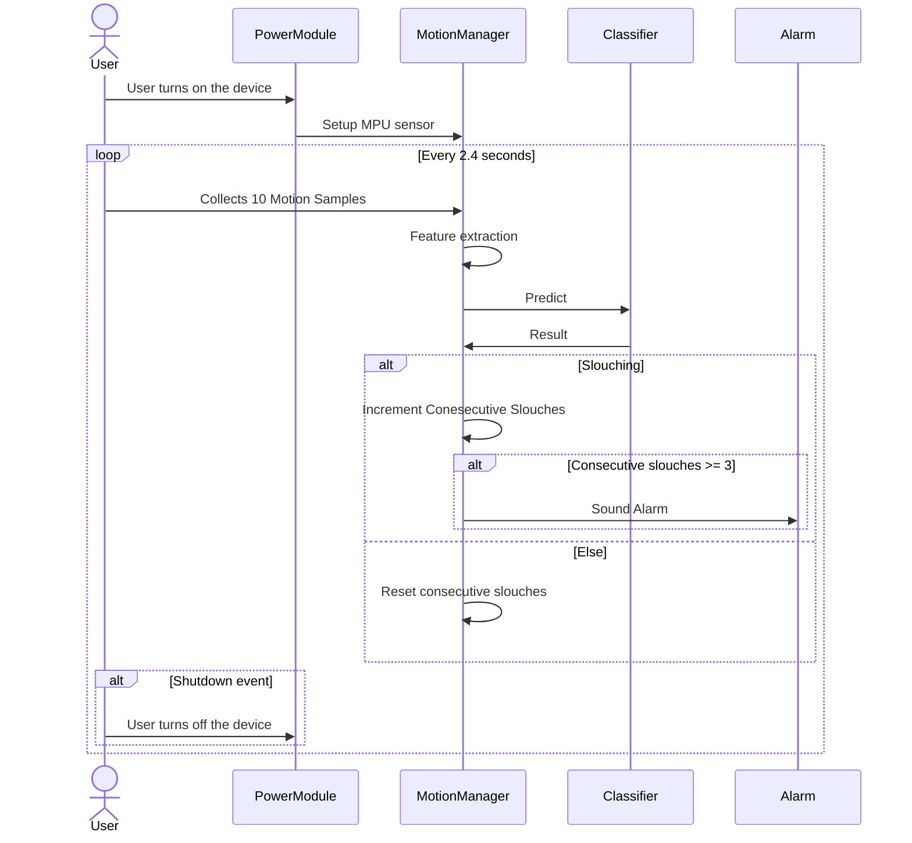

# Posture Corrector Sequence Diagram

```mermaid
sequenceDiagram
    actor User
    participant Power as PowerModule
    participant Manager as MotionManager
    participant SEFR as Classifier
    participant Buzzer as Alarm

    User->>Power : User turns on the device
    Power->>Manager : Setup MPU sensor
    loop Every 2.4 seconds
        User->>Manager : Collects 10 Motion Samples
        Manager->>Manager : Feature extraction
        Manager->>SEFR: Predict
        SEFR->>Manager: Result
        alt Slouching
            Manager->>Manager: Increment Conesecutive Slouches
            alt Consecutive slouches >= 3
                Manager->>Buzzer: Sound Alarm
            end
        else Else
            Manager->>Manager : Reset consecutive slouches
        end

        # Power off flow
        alt Shutdown event
            User->>Power : User turns off the device
        end

    end
```
